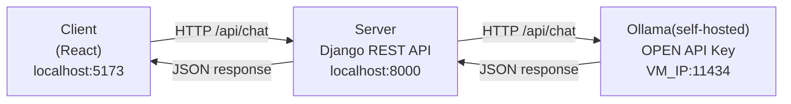

# AI Chat Assistant 
A minimal chat interface talking directly to a self-hosted Ollama model. This is the first phase of a larger project (MCP tools, agentic workflows, and RAG document intelligence come later) — deliberately kept stateless and simple so it's a solid, working foundation to build on.

## What this does

- React frontend with a chat UI
- Django REST Framework backend exposing a single `/api/chat` endpoint
- Backend forwards the conversation to a self-hosted Ollama instance (reached over Tailscale or local network) and returns the reply
- No database, no sessions — conversation state lives entirely in the browser
- Only the last 5 messages are sent to the model as context on each turn, trimmed both client-side (smaller payload) and server-side (enforced regardless of caller)

## Architecture



## Prerequisites

- Python 3.11+
- Node.js 20+
- A running Ollama instance with a model pulled (e.g. `ollama pull llama3.2:3b`), reachable from wherever this backend runs

## Project structure

```
chat-assistant/
├── docker-compose.yml
├── .gitignore
├── README.md
├── backend/
│   ├── manage.py
│   ├── requirements.txt
│   ├── .env.example
│   ├── Dockerfile
│   ├── chat_backend/
│   └── chat/
└── frontend/
    ├── package.json
    ├── Dockerfile
    ├── nginx.conf
    └── src/
```

## Setup — local development (no Docker)

**Backend:**
```bash
cd backend
python -m venv venv
source venv/bin/activate        # Windows: venv\Scripts\activate
pip install -r requirements.txt
cp .env.example .env            # edit OLLAMA_BASE_URL to point at your instance
python manage.py runserver
```

**Frontend** (separate terminal):
```bash
cd frontend
npm install
echo "VITE_API_BASE_URL=http://localhost:8000/api" > .env
npm run dev
```

Visit `http://localhost:5173`.

## Setup — Docker Compose

```bash
cp backend/.env.example backend/.env   # edit OLLAMA_BASE_URL
docker compose up -d --build
```

Visit `http://localhost` (frontend served on port 80, proxying `/api` to the backend internally).

## Environment variables (`backend/.env`)

| Variable | Description | Default |
|---|---|---|
| `SECRET_KEY` | Django secret key | — (required) |
| `DEBUG` | Django debug mode | `True` |
| `ALLOWED_HOSTS` | Comma-separated allowed hosts | `localhost,127.0.0.1` |
| `CORS_ALLOWED_ORIGINS` | Comma-separated frontend origins | `http://localhost:5173` |
| `OLLAMA_BASE_URL` | URL of your Ollama instance | `http://localhost:11434` |
| `OLLAMA_CHAT_MODEL` | Model name to use | `llama3.2:3b` |
| `MAX_HISTORY_MESSAGES` | Messages kept as context per request | `5` |

## API

### `POST /api/chat`

Request:
```json
{
  "messages": [
    { "role": "user", "content": "Hello" }
  ]
}
```

Response:
```json
{
  "role": "assistant",
  "content": "Hi! How can I help?"
}
```

## Design decisions

- **Stateless by design**: no session store in this phase — the client owns conversation history. This keeps Phase 1 simple and testable in isolation before Phase 4 introduces session-scoped state for RAG.
- **History trimming, not truncation of a single message**: capping at 5 messages rather than a character/token limit is simpler to reason about and predictable for the person using the app.
- **Server-side re-enforcement of the history limit**: the client trims before sending, but the backend trims again — the limit holds regardless of what calls the API.